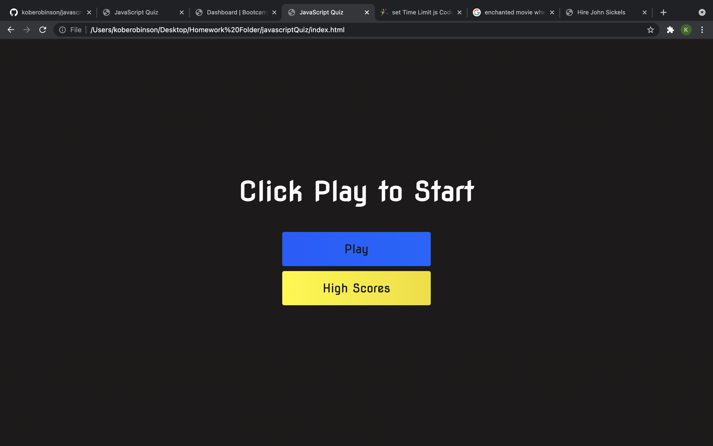

# javascriptQuiz

## Overview
This assingment was given to us to help us understand webApis. This last week was a bit challenging and frustrating to use the different lines of codes to put things into local storage or to take things out. After this assingment I am more comfortable with this topic.

My motivation for this project was to better understand the basics of webApi's

I created this assignment because lots of people even me sometimes forget the basics of html css and js. It's nice to go through and relearn everything.

I learned how to put things into local storage and to take it out on a different html. I also learned alot more about how to use flex which wasnt apart of the assingment but it was a huge help

## Installation
Installation is very easy. All you need to do is click play game, try your best ont he questions and you will be given a score according to how many you got right.

## Credits
Credits go out to AskBCS because without them I would of not been able to finish this assignment. 

## The Quiz

## Links
Link to the Quiz: https://koberobinson.github.io/javascriptQuiz/

Link to the GitHub: https://github.com/koberobinson/javascriptQuiz

## License
MIT License

Copyright (c) [2021] [Kobe Robinson]

Permission is hereby granted, free of charge, to any person obtaining a copy
of this software and associated documentation files (the "Software"), to deal
in the Software without restriction, including without limitation the rights
to use, copy, modify, merge, publish, distribute, sublicense, and/or sell
copies of the Software, and to permit persons to whom the Software is
furnished to do so, subject to the following conditions:

The above copyright notice and this permission notice shall be included in all
copies or substantial portions of the Software.

THE SOFTWARE IS PROVIDED "AS IS", WITHOUT WARRANTY OF ANY KIND, EXPRESS OR
IMPLIED, INCLUDING BUT NOT LIMITED TO THE WARRANTIES OF MERCHANTABILITY,
FITNESS FOR A PARTICULAR PURPOSE AND NONINFRINGEMENT. IN NO EVENT SHALL THE
AUTHORS OR COPYRIGHT HOLDERS BE LIABLE FOR ANY CLAIM, DAMAGES OR OTHER
LIABILITY, WHETHER IN AN ACTION OF CONTRACT, TORT OR OTHERWISE, ARISING FROM,
OUT OF OR IN CONNECTION WITH THE SOFTWARE OR THE USE OR OTHER DEALINGS IN THE
SOFTWARE.